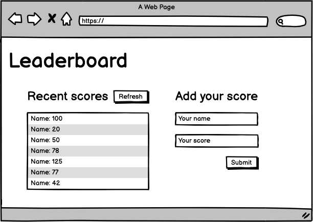

# Leaderboard: setup project

## Learning objectives

- Use callbacks and promises.
- Learn how to use proper ES6 syntax.
- Use ES6 modules to write modular JavaScript.
- Use webpack to bundle JavaScript.

### Estimated time: 2h

## Description

In this activity you will set up a JavaScript project for the Leaderboard list app, using *webpack* and *ES6* features, notably *modules*. You should develop a first working version of the app following a wireframe, but without styling - just focus on functionality. In following activities, you will consume the Leaderboard API using JavaScript *async* and *await* and add some styling.

*IMPORTANT NOTE: Read **all** requirements before you start building your project.*

### General requirements

- Make sure that there are [no linter errors](https://github.com/microverseinc/linters-config).
- Make sure that you used correct [Gitflow](https://github.com/microverseinc/curriculum-transversal-skills/blob/main/git-github/articles/gitflow.md).
- Make sure that you documented your work [in a professional way](https://github.com/microverseinc/curriculum-transversal-skills/blob/main/documentation/articles/professional_repo_rules.md).

### JavaScript requirements

  - Follow our list of [best practices for JavaScript](https://github.com/microverseinc/curriculum-html-css/blob/main/articles/javascript_best_practices.md).

### Project requirements

- **IMPORTANT NOTE** This is the first time you will use [Gitflow](https://github.com/microverseinc/curriculum-transversal-skills/blob/main/git-github/articles/gitflow.md). Keep that in mind!
- Create an **npm project with webpack**. (If you need a refresher, check the previous project or webpack exercise).
- Write plain HTML markup with minimum styling (just to make the layout), because you will implement styles in the following steps. Use this wireframe as a guide:

  

- Don't make API calls (you'll do it in a following lesson).
- Use ES6 modules, with *import* and *export*.

### Need a big picture? 

Remind me about [the big picture of this project](./sneak_peek.md).

## Work and submission mode

- You should submit this activity **individually.**

## Code review

Follow [these steps](https://github.com/microverseinc/curriculum-transversal-skills/blob/main/code-review/articles/how_to_ask_for_a_code_review.md) to request a code review of your project.

## Submit your project

After the final approval from a code reviewer, you need to submit your project.
[Read this FAQ for a reminder on how to submit your project.](https://microverse.zendesk.com/hc/en-us/articles/360061344234)
Now go to your Student Dashboard and submit your project.

------

_If you spot any bugs or issues in this activity, you can [open an issue with your proposed change](https://github.com/microverseinc/curriculum-transversal-skills/blob/main/git-github/articles/open_issue.md)._
