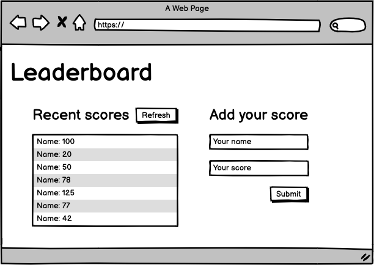

# Leaderboard: final touches

## Learning objectives

- Understand how to use medium-fidelity wireframes to create a UI.

### Estimated time: 4h

## Description

In this activity you will finalize the *Leaderboard list* app, adding the styles needed to make it look great.

*IMPORTANT NOTE: Read **all** requirements before you start building your project.*

### General requirements

- Make sure that there are [no linter errors](https://github.com/microverseinc/linters-config).
- Make sure that you used correct flow [Gitflow](https://github.com/microverseinc/curriculum-transversal-skills/blob/main/git-github/articles/gitflow.md).
- Make sure that you documented your work [in a professional way](https://github.com/microverseinc/curriculum-transversal-skills/blob/main/documentation/articles/professional_repo_rules.md).

### HTML/CSS requirements

- Follow our list of [best practices for HTML & CSS](https://github.com/microverseinc/curriculum-html-css/blob/main/articles/html_css_best_practices.md).

### Project requirements

- At this point you should have a fully working app that uses only basic styles to make the layout work, according to this wireframe:

  

- Now you should improve the *look and feel* of the application, adding the styles of your choice.
- Please keep the general layout of the wireframe, this is the only mandatory requirement.
- You can use plain CSS or any CSS framework, it's up to you.

### Need a big picture? 

Remind me about [the big picture of this project](./sneak_peek.md).

## Work and submission mode

- You should submit this activity **individually.**

## Code review

Follow [these steps](https://github.com/microverseinc/curriculum-transversal-skills/blob/main/code-review/articles/how_to_ask_for_a_code_review.md) to request a code review of your project.

## Submit your project

After the final approval from a code reviewer, you need to submit your project.
[Read this FAQ for a reminder on how to submit your project.](https://microverse.zendesk.com/hc/en-us/articles/360061344234)
Now go to your Student Dashboard and submit your project.

------

_If you spot any bugs or issues in this activity, you can [open an issue with your proposed change](https://github.com/microverseinc/curriculum-transversal-skills/blob/main/git-github/articles/open_issue.md)._
