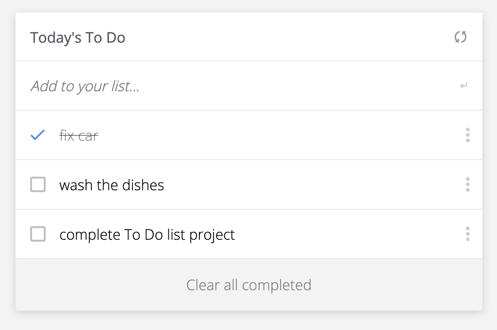

# Sneak peek: To Do list

## Learning objectives
- Build a website based on an existing website.

### Estimated time: 0.5h

## Description

"To Do list" is a tool that helps to organize your day. It simply lists the things that you need to do and allows you to mark them as complete.
You will build a simple website that allows for doing that, and you will do it with the usage of ES6 and Webpack!

### How to build the "To Do list" website?

You will build a very simple yet powerful To Do list. It will be inspired by the [minimalist](http://www.getminimalist.com/) website.
The final result will look similar to:

  

You will need to implement the following functionalities:
- Adding a new item.
- Removing selected item.
- Reordering selected item (as drag&drop).
- Marking a selected item as complete.
- Removing all items marked as complete at once.

Go back to the [minimalist](http://www.getminimalist.com/) demo page to play around with the mentioned functionalities.

### Projects list

You will be building a "To Do list" website during the whole week. Here is the list of projects that will guide you through the functionalities described above. You will find details about each of the milestone requirements in the upcoming program activities.

- Milestone 1: list structure.
- Milestone 2: interactive list.
- Milestone 3: add and remove items.
